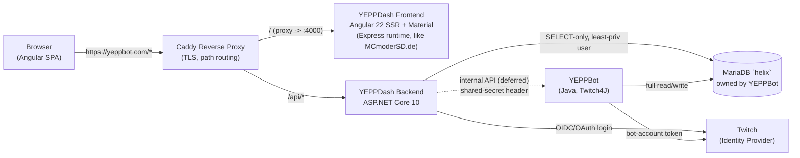
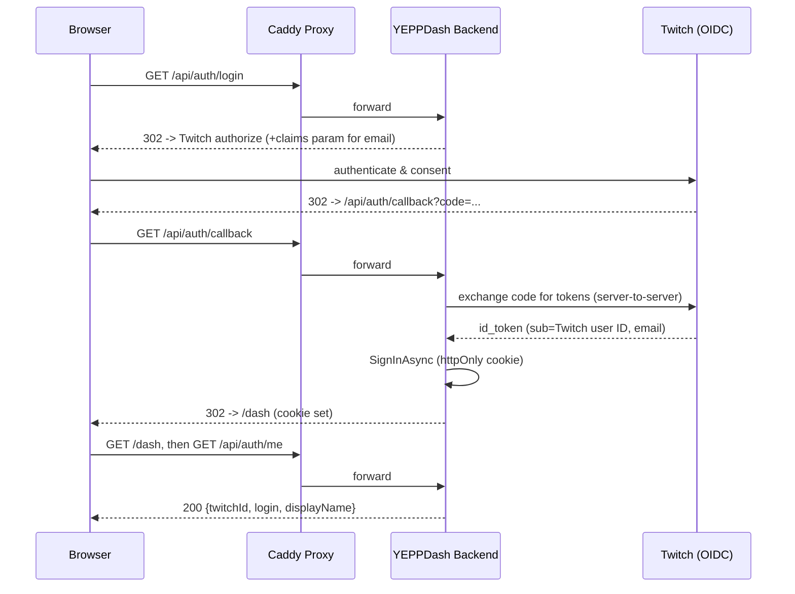
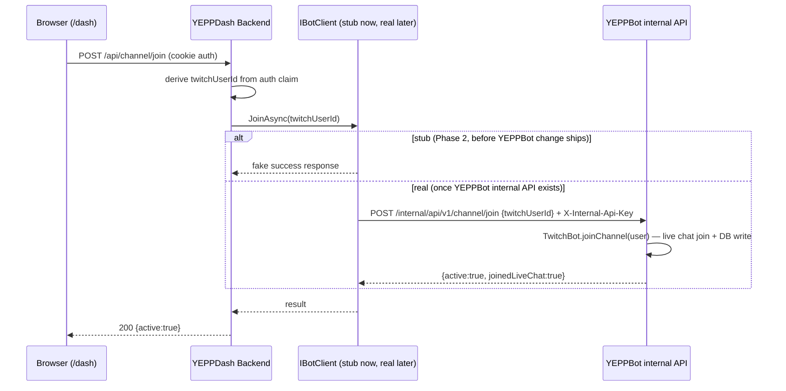

# YEPPDash — Implementation Plan

## Context

YEPPBot (`C:\Users\MCmoderSD\IdeaProjects\Current\YEPPBot`, Java 25/Maven) is a monolithic Twitch chat bot with a MariaDB backend (`helix` schema) and **no interactive console or admin UI** — the only ways to control it today are Twitch chat commands, the Twitch API, and direct database edits. That's intentional: it keeps the bot's attack surface small. The goal now is to give broadcasters a proper web dashboard (like StreamElements has for its bot) to control YEPPBot functions, starting with adding/removing the bot from their channel, without weakening that security posture.

Key constraint discovered while exploring YEPPBot: **the bot reads its `Channel` table exactly once, at startup** — there is no polling loop or live-update mechanism. Writing `Channel.active=1` to the database from a dashboard would silently do nothing to the running bot. The bot's real join logic lives in `TwitchBot.joinChannel(TwitchUser)`/`leaveChannel(TwitchUser)` (`src/main/java/de/MCmoderSD/core/TwitchBot.java:422-480`), which calls the live Twitch4J chat client **and then** persists the DB flag. This confirms the user's own design intent: the dashboard backend must talk to a real interface on YEPPBot (not just the shared database) for any bot-affecting action, keeping YEPPBot's only inputs as "its own internal API" + "the Twitch API."

The bot already has an idle, reusable HTTP(S) server (`de.MCmoderSD:HTTPS-Server`, wraps Undertow, `Server.registerPrefixPath(...)`), currently only serving one static OAuth-callback page (`Main.java:108-111`) — the natural place to add a small internal join/leave/status API later.

Outcome of this plan: a new standalone repo, `YEPPDash`, with an ASP.NET Core 10 backend and an Angular 22 + Material frontend, authenticating end users exclusively via Twitch (their Twitch ID doubles as the primary key already used in YEPPBot's `User`/`Channel` tables — no separate identity mapping needed), reading channel status read-only from the shared MariaDB, and — once a **separate, later** YEPPBot-side change adds the internal API — driving join/leave through it instead of the database directly.

**Explicitly deferred by the user**: the YEPPBot-side companion API (new Java HTTP handler) is *not* part of this engagement. This plan documents the contract the backend needs, and the backend is built against an abstraction (`IBotClient`) with a stub implementation so dashboard development isn't blocked on that separate work. Command management (beyond join/leave) is also out of scope for v1.

---

## Architecture Overview







---

## Repository Structure

Monorepo at `C:\Users\MCmoderSD\Desktop\YEPPDash` (not yet a git repo — `git init` is step 1):

```
YEPPDash/
├── docker-compose.yml          # dev: seeded mariadb, backend, frontend, caddy
├── infra/
│   ├── Caddyfile                # yeppbot.com/ -> frontend, /api/* -> backend
│   └── db/seed/                 # dev-only copies of YEPPBot's CREATE TABLE IF NOT EXISTS scripts
├── backend/
│   ├── YEPPDash.slnx            # XML solution format (Rider/.NET 10) — cleaner git diffs than classic .sln
│   ├── global.json
│   ├── YEPPDash.Api/            # sibling to the .slnx, standard .NET layout (no extra src/ nesting)
│   │   ├── Program.cs           # top-level statements
│   │   ├── Auth/            # Twitch OIDC + cookie scheme wiring
│   │   ├── Endpoints/       # AuthEndpoints.cs, ChannelEndpoints.cs (minimal APIs)
│   │   ├── Data/            # Dapper repositories (ChannelRepository, UserRepository)
│   │   ├── BotClient/       # IBotClient + HttpBotClient + StubBotClient
│   │   ├── Contracts/       # request/response DTOs
│   │   └── Options/         # TwitchOptions, BotApiOptions, DatabaseOptions
│   └── YEPPDash.Api.Tests/
└── frontend/
    └── src/app/
        ├── core/auth/            # auth.service.ts, auth.guard.ts, auth.interceptor.ts
        ├── core/channel/         # channel.service.ts
        ├── features/landing/     # "/" — Login with Twitch
        ├── features/dash/        # "/dash" — join/leave card
        └── shared/material-theme/  # generated M3 theme + brand overrides
```

---

## Backend Design (ASP.NET Core 10)

### Auth
`Microsoft.AspNetCore.Authentication.OpenIdConnect` against Twitch's OIDC endpoints (`https://id.twitch.tv/.well-known/openid-configuration`), cookie scheme as the default/protecting scheme, OIDC only as the challenge scheme on `/api/auth/login`. Twitch quirk: email is only returned if the authorize request carries an explicit `claims={"id_token":{"email":null}}` parameter — inject it in `OnRedirectToIdentityProvider`. `sub` claim = Twitch user ID = the same ID already used as PK in YEPPBot's `User`/`Channel` tables, so no mapping table is needed. Fallback if OIDC proves awkward: hand-rolled `AddOAuth` + a call to Helix `GET /users` in `OnCreatingTicket`. Cookie: httpOnly, Secure, `SameSite=Lax` (compatible with Twitch's redirect-back GET, no CORS needed at all since frontend and backend share an origin behind Caddy).

### Database access
Dapper + `MySqlConnector`, deliberately **not** EF Core — the `helix` schema is owned and migrated solely by YEPPBot's own `CREATE TABLE IF NOT EXISTS` scripts, and `User.user` is an LZ4-compressed Java-serialized blob that's undecodable from C# and must simply never be selected. Backend DB user gets **SELECT-only** grants on `User`/`Channel` — no write grants at all, so "all mutations go through the bot" is enforced by the database, not just convention. Verify empirically in Phase 0 how MySqlConnector maps `BIT(1)` columns (`Channel.active`/`autoShoutout`) — may need a small Dapper `TypeHandler`.

### Internal Bot interface (contract now, implementation deferred)
Backend defines `IBotClient` with `GetStatusAsync`, `JoinAsync`, `LeaveAsync(twitchUserId)`. Two implementations: `StubBotClient` (in-memory fake, used until the YEPPBot-side API exists — lets Phase 2 ship a working UI demo now) and `HttpBotClient` (typed `HttpClient` + Polly retry, calling the documented contract below once it's built on the YEPPBot side, separately). Swap via config/DI — no code changes needed in `Endpoints/` when the switch happens.

Documented target contract (for whoever implements the YEPPBot side later):

| Method & Path | Auth | Body | 200 Response |
|---|---|---|---|
| `GET /internal/api/v1/health` | `X-Internal-Api-Key` | — | `{"status":"ok"}` |
| `GET /internal/api/v1/channel/status/{twitchUserId}` | header | — | `{"channelId":123,"active":true,"joinedLiveChat":true}` |
| `POST /internal/api/v1/channel/join` | header | `{"twitchUserId":123}` | `{"channelId":123,"active":true,"joinedLiveChat":true}` |
| `POST /internal/api/v1/channel/leave` | header | `{"twitchUserId":123}` | `{"channelId":123,"active":false,"joinedLiveChat":false}` |

The shared-secret header is required **regardless of network topology** (see Deployment) — the user wants the option to split backend and bot across hosts later, so auth can't rely on network isolation alone.

### Public API (v1)

| Method & Path | Auth | Purpose |
|---|---|---|
| `GET /api/auth/login` | anon | 302 → Twitch authorize |
| `GET /api/auth/callback` | anon | completes login, sets cookie, 302 → `/dash` |
| `POST /api/auth/logout` | cookie | clears cookie |
| `GET /api/auth/me` | cookie | `{twitchId, login, displayName, profileImageUrl}` |
| `GET /api/channel/status` | cookie | via `IBotClient`, for caller's own Twitch ID |
| `POST /api/channel/join` | cookie | via `IBotClient` |
| `POST /api/channel/leave` | cookie | via `IBotClient` |

Target channel is always derived from the auth cookie's claim, never accepted from the client.

### NuGet packages
`Microsoft.AspNetCore.Authentication.OpenIdConnect`, `Dapper`, `MySqlConnector`, `Microsoft.Extensions.Http` + `Microsoft.Extensions.Http.Resilience` (for `HttpBotClient`), `Microsoft.AspNetCore.OpenApi`, `Serilog.AspNetCore`, `Microsoft.Extensions.Diagnostics.HealthChecks`. Dev-only: `dotnet user-secrets` for Twitch client secret + internal API key.

---

## Frontend Design (Angular 22 + Material)

Standalone components, functional `CanActivateFn` guards, signals for state (no NgRx needed at this scope). `app.config.ts` wires `provideRouter`, `provideHttpClient(withFetch())`, `provideAnimationsAsync()`. `authGuard` on `/dash` checks a signal hydrated from `GET /api/auth/me`. Login is a plain `<a href="/api/auth/login">` (full navigation, not a router link or XHR) so the server-driven OAuth redirect chain works.

**Theming**: seed color `#9ACD32` (`rgb(154,205,50)`) via `ng generate @angular/material:m3-theme` (dark mode). M3's computed dark surface/background tones won't land exactly on the target `#18181B` (`rgb(24,24,27)`, Twitch's chrome) since they're derived from the seed hue — after generating the theme, explicitly override `--mat-sys-surface`/`--mat-sys-background`/related `surface-container*` tokens to `#18181B` in a clearly-marked brand-override block, so future Material upgrades don't silently regenerate over it.

**SSR**: reuse the same setup already proven in the `MCmoderSD.de` portfolio project (`C:\Users\MCmoderSD\WebstormProjects\Webpage`) — Angular 22 + `@angular/ssr` + Express runtime server (`src/server.ts`, `serve:ssr:*` npm script), same Angular/Material versions (`^22.0.x`), same 4-stage Dockerfile pattern (deps → build → prod-deps → runtime, non-root user, port 4000). Unlike the portfolio (which prerenders every route via `RenderMode.Prerender` on `**` in `app.routes.server.ts`), YEPPDash needs **hybrid per-route rendering**: `/` stays `RenderMode.Prerender` (build-time static HTML — SEO/link-preview metadata for Discord/Twitter shares of `yeppbot.com`, zero runtime cost for that route), `/dash` is `RenderMode.Client` (personalized, behind the auth guard — cannot be prerendered at build time, rendered client-side like a normal SPA once the session cookie is confirmed via `/api/auth/me`).

Packages: `@angular/material`, `@angular/cdk`, `@angular/animations`, `@angular/ssr`, `@angular/platform-server`, `express`, `compression`, `angular-eslint`, `prettier`.

---

## Deployment

**Caddy** reverse proxy, single domain `yeppbot.com`, path-based routing (`/` → Frontend SSR container `:4000`, `/api/*` → Backend container) — avoids CORS entirely and keeps cookies same-site (`SameSite=Lax`), and Caddy's automatic HTTPS can also simplify YEPPBot's currently-manual cert handling if reused there later.

**Docker images**: both frontend and backend are multi-stage builds producing slim runtime images — never `dotnet run`/`ng serve` inside a container, those are dev-only. Backend: SDK image builds + publishes, `mcr.microsoft.com/dotnet/aspnet:10.0` runs `dotnet YEPPDash.Api.dll`. Frontend: reuse the exact 4-stage pattern from `MCmoderSD.de`'s `Dockerfile` (deps/build/prod-deps/runtime on `node:26-alpine`, non-root user, `CMD ["node", "dist/YEPPDash/server/server.mjs"]`, `EXPOSE 4000`) — proven, already in production use, no need to design a new pattern.

Backend and YEPPBot run on the same dedicated server in Docker for now, but should stay portable to split hosts later. Design for that from day one: the Bot API base URL is a config value (not hardcoded `localhost`), and the shared-secret header is always required (not "trust the private network" alone). Today, keep the internal API off the public Caddy routes entirely (only reachable on the shared Docker network); if it's ever split across hosts, front the internal API with a private tunnel (WireGuard/Tailscale) or an IP-allowlisted TLS listener — an ops-time decision, no code changes needed since the client already carries a config URL + secret.

---

## Phased Roadmap

**Phase 0 — Scaffolding & smoke tests**: `git init`; `dotnet new webapi` for `YEPPDash.Api`; `ng new frontend --standalone --routing --style=scss`, add Material + generate M3 theme with brand override; add Dapper/MySqlConnector and a throwaway `GET /api/_internal/dbcheck` to validate DB connectivity and the `BIT(1)` mapping against a least-priv read-only user; local `docker-compose.yml` with dev MariaDB seeded from copies of YEPPBot's `.sql` files, backend, frontend, Caddy — confirm the full path-routed round trip and theme render. Also generate the three diagrams above as real `.excalidraw` scene files (architecture, auth sequence, join sequence) for editing/sharing.

**Phase 1 — Twitch auth end-to-end**: register a Twitch app (redirect URIs for prod + local dev); implement backend OIDC + `/api/auth/*`; implement frontend landing page, guard, `AuthService`, `/dash` shell. Exit: real login → `/dash`, session survives refresh, logout works.

**Phase 2 — Channel join/leave v1 (against `StubBotClient`)**: backend `/api/channel/*` + `IBotClient`/`StubBotClient`; frontend status card + join/leave button with loading/error states. Exit: full UI flow works end-to-end against the stub. Swapping in `HttpBotClient` once the separate YEPPBot-side API change ships is a config-only follow-up, not a code change here.

**Phase 3 — Command management**: placeholder only, scope later.

---

## Verification

- Phase 0: `GET /api/_internal/dbcheck` returns a row count from the seeded dev DB; Angular renders through `https://localhost/` (Caddy) with the correct green/dark theme in both light/dark OS settings.
- Phase 1: manual browser test — click "Login with Twitch" through to `/dash`, confirm `GET /api/auth/me` returns the right Twitch ID, confirm cookie is httpOnly/Secure in devtools, confirm logout clears the session.
- Phase 2: manual browser test against the stub — join/leave button toggles status card state, error state renders if the stub simulates a failure. Once the real YEPPBot internal API exists (separate task), re-test the same flow with `HttpBotClient` and confirm the bot actually joins live Twitch chat, not just the DB flag.