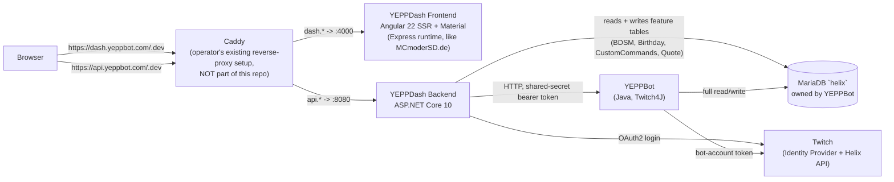
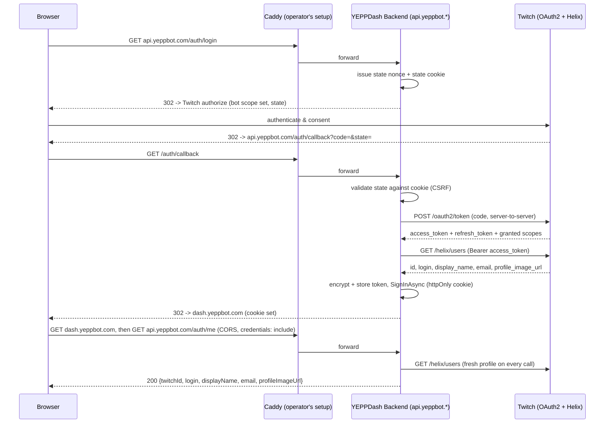
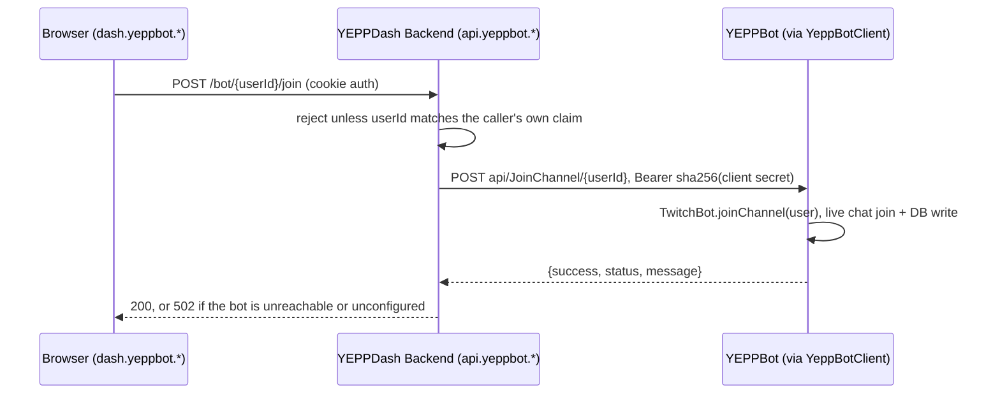

# YEPPDash — Implementation Plan

## Context

YEPPBot (`C:\Users\MCmoderSD\IdeaProjects\Current\YEPPBot`, Java 25/Maven) is a monolithic Twitch chat bot with a MariaDB backend (`helix` schema) and **no interactive console or admin UI** — the only ways to control it today are Twitch chat commands, the Twitch API, and direct database edits. That's intentional: it keeps the bot's attack surface small. The goal now is to give broadcasters a proper web dashboard (like StreamElements has for its bot) to control YEPPBot functions, starting with adding/removing the bot from their channel, without weakening that security posture.

Key constraint discovered while exploring YEPPBot: **the bot reads its `Channel` table exactly once, at startup** — there is no polling loop or live-update mechanism. Writing `Channel.active=1` to the database from a dashboard would silently do nothing to the running bot. The bot's real join logic lives in `TwitchBot.joinChannel(TwitchUser)`/`leaveChannel(TwitchUser)` (`src/main/java/de/MCmoderSD/core/TwitchBot.java:422-480`), which calls the live Twitch4J chat client **and then** persists the DB flag. This confirms the user's own design intent: the dashboard backend must talk to a real interface on YEPPBot (not just the shared database) for any bot-affecting action, keeping YEPPBot's only inputs as "its own internal API" + "the Twitch API."

The bot already has an idle, reusable HTTP(S) server (`de.MCmoderSD:HTTPS-Server`, wraps Undertow, `Server.registerPrefixPath(...)`), currently only serving one static OAuth-callback page (`Main.java:108-111`) — the natural place to add a small internal join/leave/status API later.

Outcome of this plan: a new standalone repo, `YEPPDash`, with an ASP.NET Core 10 backend and an Angular 22 + Material frontend, authenticating end users exclusively via Twitch (their Twitch ID doubles as the primary key already used in YEPPBot's `User`/`Channel` tables — no separate identity mapping needed), reading channel status read-only from the shared MariaDB, and — once a **separate, later** YEPPBot-side change adds the internal API — driving join/leave through it instead of the database directly.

**Explicitly deferred by the user at the time**: the YEPPBot-side companion API (new Java HTTP handler) was *not* part of this engagement's first cut. This plan originally documented the contract the backend would need and had the backend built against an abstraction (`IBotClient`) with a stub implementation, so dashboard development wasn't blocked on that separate work. Command management (beyond join/leave) was also out of scope for v1 at the time.

> **Status update**: both of those have since shipped. The YEPPBot-side companion API exists and is what YEPPDash talks to today (see [Bot integration](#bot-integration-implemented) below and [`docs/yeppbot-api-client.md`](docs/yeppbot-api-client.md)) — replacing the planned `IBotClient`/`StubBotClient`/`HttpBotClient` abstraction outright rather than filling it in. Command management, quote management, birthday tracking and BDSM test results have all shipped too; see [`ROADMAP.md`](ROADMAP.md) for what and when. The rest of this document is kept for its design rationale, but treat any section describing something as "deferred," "Phase 2," or "stub" as historical unless a note says otherwise.

---

## Architecture Overview

All three diagrams below are also available as editable scenes in [`docs/diagrams/`](docs/diagrams) (`architecture.excalidraw`, `auth-flow.excalidraw`, `join-flow.excalidraw`) — open them at [excalidraw.com](https://excalidraw.com) for a version you can rearrange, annotate, or export from directly.



Note: `dash.` and `api.` are separate subdomains (not path prefixes on one origin), so frontend↔backend calls are cross-origin from the browser's point of view — see [Auth](#auth) and [Deployment](#deployment) for what that changes.





(This replaced the originally planned `IBotClient`/`StubBotClient`/`HttpBotClient` abstraction shown in earlier revisions of this diagram — see the status update above.)

---

## Repository Structure

Monorepo at `C:\Users\MCmoderSD\Desktop\YEPPDash` (not yet a git repo — `git init` is step 1):

```
YEPPDash/
├── docker-compose.yml          # local only: backend + frontend, published directly on :8080/:4000 — no reverse proxy in this repo
├── .env.example                 # DB_TARGET + both HelixDev/HelixProd connection strings (real values in gitignored .env)
├── backend/
│   ├── YEPPDash.slnx            # XML solution format (Rider/.NET 10), cleaner git diffs than classic .sln
│   ├── global.json
│   ├── YEPPDash.Api/            # sibling to the .slnx, standard .NET layout (no extra src/ nesting)
│   │   ├── Program.cs           # composition root only, builder/DI wiring, no endpoint/business logic
│   │   ├── Auth/            # AddYeppDashAuth (cookie scheme), state cookie, token store + AES-GCM cipher, claim types
│   │   ├── Twitch/          # TwitchOAuthClient (id.twitch.tv), TwitchApiClient (Helix), scopes + options
│   │   ├── Bot/             # YeppBotClient, the dashboard's HTTP client for a running YEPPBot instance
│   │   ├── Controllers/     # one MVC controller per feature: Auth, Bot, Twitch, CustomCommand, Quote, Birthday, Bdsm, Status
│   │   ├── Services/        # business logic between controllers and clients/repositories
│   │   ├── Repositories/    # Dapper access, one per table/feature, plus the YEPPDash-database plumbing (TwitchToken)
│   │   ├── Data/            # per-feature request/response DTOs, e.g. Data/Twitch, Data/Quote, Data/Birthday, Data/CustomCommand, Data/Bdsm
│   │   ├── Exceptions/      # per-feature exception types the controllers translate into HTTP responses
│   │   ├── Helpers/         # cross-cutting extensions (ConfigurationExtensions, ClaimsPrincipalExtensions)
│   │   └── Options/         # TwitchOptions, YeppBotOptions, DatabaseOptions
│   └── YEPPDash.Api.Tests/
└── frontend/
    └── src/
        ├── pages/            # routed pages: landing, dash shell + its children, imprint/privacy/terms
        ├── components/       # feature components the dash pages compose (role-management, quote-management, bot-manage, ...)
        ├── services/         # ApiService base + one service per feature, auth.guard, dash-host
        ├── data/             # plain types/helpers shared between a feature's service and its components
        └── pipes/            # e.g. LocaleDatePipe
```

---

## Backend Design (ASP.NET Core 10)

### Auth
Plain **OAuth2 authorization code flow**, driven by hand against `https://id.twitch.tv/oauth2/*` — no OIDC middleware, no `openid` scope, no `id_token`. Identity comes from `GET /helix/users` with the freshly obtained access token, which returns exactly the `id` / `login` / `display_name` / `email` / `profile_image_url` the dashboard needs.

**Why not OIDC** (it was implemented first and then replaced, see [ROADMAP.md](ROADMAP.md#phase-1b--von-oidc-auf-direktes-oauth2)): the dashboard has to hold a broadcaster access token anyway to manage the bot's moderator status, to detect a banned/blocked bot, and to join/leave a channel. OIDC delivered identity in a second, separate mechanism on top of that token — two flows where one suffices. On top of that, Twitch's OIDC implementation needed three workarounds (non-standard discovery path, a `claims` request parameter for `email`/`preferred_username`, `response_mode=query`) that all disappear with the plain flow. The only thing given up is the signed `id_token`; the identity is now asserted by a server-to-server TLS call to Helix instead, which is at least as trustworthy.

**Scopes**: the exact sets YEPPBot's own two Twitch apps request, picked by `DbTarget` (`TwitchScopes.For`). Prod asks for the 13 scopes the bot actually needs in production; Dev asks for Twitch's complete catalogue (80 scopes) so new bot features can be tried out without a re-authorization round. Dashboard and bot share one app per environment, so a single consent covers both — a user who logs into the dashboard has thereby granted the bot everything it needs.

**Sessions**: cookie authentication (`yeppdash.session`, httpOnly, Secure, `SameSite=Lax`, 14 days sliding), registered as the *only* scheme. There is no challenge scheme, so an unauthenticated request can never accidentally trigger a redirect to Twitch — `/auth/login` is the single entry point into the flow. `SameSite=Lax` works everywhere because frontend and backend share a registrable domain (`dash.`/`api.yeppbot.com` in production, `localhost` in development) and the OAuth callback is a top-level GET.

The cookie only carries `twitch_id` (plus `twitch_login` as an offline display fallback). Everything else is re-read from Helix on every `/auth/me`, because only the ID is stable — logins, display names, avatars and e-mail addresses all change. The Twitch user ID is also the PK of YEPPBot's `User`/`Channel` tables, so no mapping table is needed.

**CSRF**: the `state` parameter is owned by the app now that the middleware no longer provides it. A 32-byte random nonce goes into the authorize URL and, together with the return URL, into a short-lived (10 min) httpOnly state cookie; the callback compares them in constant time and consumes the cookie either way. The return URL never travels through Twitch and is additionally validated against `AllowedFrontendOrigins`.

**Token storage**: access and refresh token land in `TwitchToken` in YEPPDash's *own* database, AES-256-GCM encrypted with a key derived from the Twitch client secret (`AesGcmTokenCipher`) — one secret for the whole deployment, no separate key management, and rotating the client secret invalidates all stored tokens exactly as it does for the bot. `TwitchAuthService.GetValidTokenAsync` refreshes transparently 5 minutes before expiry and replaces the stored row, since Twitch may hand back a new refresh token. Without a configured `ConnectionStrings:YeppDash{DbTarget}` the backend falls back to an in-memory store and logs a warning, so a fresh clone can run the login flow before any database work happens.

> **Deliberately *not* shared with the bot**: YEPPBot keeps its own tokens in `helix.RefreshToken` (encrypted AES-ECB with SHA3-256 of the client secret, see `Helix-API/SQL.java`). Writing into that table would provision the bot from a dashboard login, but both processes would then share one refresh token per user, and because Twitch rotates the refresh token on use, whichever side refreshes second gets rejected. Separate tokens per process avoids that race. Handing tokens over to the bot remains a possible future topic and, if it happens, belongs in the bot's own HTTP API rather than in a shared table.

**Twitch application**: YEPPDash doesn't register its own Twitch app — it reuses YEPPBot's existing Dev and Prod apps (same `clientId`/`clientSecret` the bot itself already uses for its own OAuth flow), since dashboard and bot are the same product/identity. Credentials for both are stored as `Twitch:ClientIdDev`/`ClientSecretDev` and `Twitch:ClientIdProd`/`ClientSecretProd` via `dotnet user-secrets` locally, mirroring the `ConnectionStrings:HelixDev`/`HelixProd` pattern — never committed. Twitch apps accept multiple registered OAuth redirect URLs, so YEPPDash's callback(s) are *added* alongside the bot's existing `https://home.mcmodersd.de:420/callback`, not a replacement for it. Needed additions (one Twitch Developer Console change per environment, done by the operator, not by this repo):

| Environment | Redirect URI to add |
|---|---|
| Local dev | `https://localhost:7218/auth/callback` (Kestrel's own HTTPS port from `launchSettings.json`, backend run directly via `dotnet run`/Rider — no Docker, no Caddy; port 8080 was already in use on the dev machine) |
| Prod (once deployed) | `https://api.yeppbot.com/auth/callback` |
| Dev (once deployed) | `https://api.yeppbot.dev/auth/callback` |

**Cross-origin implication of the subdomain split**: `dash.yeppbot.com` and `api.yeppbot.com` are two different origins to the browser (different host), even though they're the same registrable domain — `SameSite=Lax` still ships the cookie (subdomains are "same-site"), but the frontend's `fetch()` calls to the API are now genuinely cross-origin and require CORS. Backend needs `AddCors` with an explicit allowlist (`https://dash.yeppbot.com`, `https://dash.yeppbot.dev`, plus local dev origins) and `AllowCredentials()`; frontend's `HttpClient` calls need `withCredentials: true` (Angular's `withFetch()` + `credentials: 'include'`). This wasn't needed under the old single-origin, path-routed design — it's a direct consequence of moving to `dash.*`/`api.*` subdomains.

### Database access
Dapper + `MySqlConnector`, deliberately **not** EF Core — the `helix` schema is owned and migrated solely by YEPPBot's own `CREATE TABLE IF NOT EXISTS` scripts, and `User.user` is an LZ4-compressed Java-serialized blob that's undecodable from C# and must simply never be selected. Confirmed in Phase 0: MySqlConnector maps `BIT(1)` columns (`Channel.active`/`autoShoutout`) as `UInt64`, not `bool` — a `BitBoolTypeHandler` registered once in `Program.cs` fixes this for every query.

> **Status update**: the original design gave the backend DB user (`yeppdash_ro`) SELECT-only grants on `User`/`Channel`, so "all mutations go through the bot" was enforced by the database itself, not just convention. That held for Phase 0/1, but doesn't anymore: `BirthdayRepository`, `CustomCommandRepository`, `BdsmRepository` (read-only in practice today) and `QuoteRepository` read **and write** their respective `helix` tables (`Birthday`, `CustomCommands`, `Quote`) directly, over the same connection. "Only the bot mutates `helix`" is no longer true at the database-grant level; it now holds only for the tables the bot itself owns semantically (`User`, `Channel`), and mutation safety for the dashboard's own tables is enforced in the controllers (self-channel-only checks) rather than by grants. The `yeppdash_ro` name is accordingly misleading, as already noted in [ROADMAP.md](ROADMAP.md#phase-1b--von-oidc-auf-direktes-oauth2).

There is no dedicated local/dev-only database — the app always talks to one of the two real MariaDB servers the bot already uses: Dev (`10.10.10.1`) and Prod (`dedi.mcmodersd.de`). Both connection strings (`ConnectionStrings:HelixDev`/`ConnectionStrings:HelixProd`) are always configured; a `DbTarget` setting (`Dev` or `Prod`, default `Dev`) picks which one is actually used, so the same container image can point at either without a rebuild. A separate `YEPPDash` database (own schema, not `helix`) exists on both servers for dashboard-specific state, with a full-access app user. It is reached through its own connection string (`ConnectionStrings:YeppDashDev`/`YeppDashProd`) and its own `YeppDashConnectionFactory`, deliberately kept apart from the read-only `helix` connection so the two access levels cannot be mixed up. `TwitchToken` (encrypted Twitch tokens, see [Auth](#auth)) is the first table living there; it is created on startup via `CREATE TABLE IF NOT EXISTS`, the same self-provisioning approach Helix-API uses.

### Bot integration (implemented)
The `IBotClient`/`StubBotClient`/`HttpBotClient` abstraction this plan originally called for was never built as designed. Instead, YEPPBot got a small HTTP API of its own, and the backend's `YeppBotClient` (`backend/YEPPDash.Api/Bot/`) talks to it directly, no interface, no stub, no separate Phase. Full reference: [`docs/yeppbot-api-client.md`](docs/yeppbot-api-client.md); summary:

| Method & Path | Auth | Notes |
|---|---|---|
| `POST api/JoinChannel/{channelId}` | `Bearer sha256(Twitch:ClientSecret{DbTarget})` | idempotent, already-joined still answers 200 |
| `POST api/LeaveChannel/{channelId}` | same | |
| `POST api/UpdateCustomCommands/{channelId}` | same | reload is async on the bot's side; success only means it started |

`{channelId}` is the channel owner's Twitch user id. There's no separate API key to manage: both sides derive the bearer token from the Twitch application client secret they already share, so nothing new needs configuring or rotating for this link. The bot's base URL is optional (`YeppBot:BaseUrl{DbTarget}`) — unconfigured, `YeppBotClient.Configured` is `false` and every call becomes a no-op instead of an error, since the database writes are the source of truth and the bot picks them up on its own next restart regardless. A `401`/`403` from the bot is not passed through to the browser (that means the dashboard's own token is wrong, an operator problem), it's logged and reported as `502`.

`BotController` exposes `POST bot/{userId}/join` / `POST bot/{userId}/leave`, both owner-only (the session may only move the bot in its own channel). `CustomCommandService` calls `UpdateCustomCommandsAsync` after every write that changes what the bot should answer; that call is best-effort and never fails the edit itself.

### Public API (v1)

| Method & Path | Auth | Purpose |
|---|---|---|
| `GET /auth/login` | anon | 302 → Twitch authorize |
| `GET /auth/callback` | anon | completes login, sets cookie, 302 → `dash.yeppbot.*` |
| `POST /auth/logout` | cookie | clears cookie |
| `GET /auth/me` | cookie | `{twitchId, login, displayName, profileImageUrl}` |
| `POST /bot/{userId}/join` | cookie, owner-only | asks YEPPBot to join the caller's own channel chat |
| `POST /bot/{userId}/leave` | cookie, owner-only | asks YEPPBot to leave the caller's own channel chat |
| `GET /twitch/chat-color/{userId?}` | cookie | `{id, color}` from Helix, caller's own when `userId` is omitted |
| `GET /twitch/users?id=&login=` | cookie | Helix get users, up to 100 ids/logins mixed per call |
| `GET /twitch/moderators`, `GET /twitch/moderators/check?id=` | cookie | full moderator list / single check, paginated + cached |
| `POST`/`DELETE /twitch/moderators/{userId}` | cookie | Helix add/remove channel moderator |
| `GET /twitch/vips`, `GET /twitch/vips/check?id=` | cookie | full VIP list / single check, paginated + cached |
| `POST`/`DELETE /twitch/vips/{userId}` | cookie | Helix add/remove channel VIP |
| `GET /twitch/editors`, `GET /twitch/editors/check?id=` | cookie | read-only, Helix has no add/remove for editors |
| `GET /twitch/followers`, `GET /twitch/followers/{userId}` | cookie | full follower list / single follow-status check |
| `GET /twitch/banned/{userId}`, `DELETE /twitch/banned/{userId}` | cookie | ban status / unban |
| `GET /twitch/blocked`, `DELETE /twitch/blocked/{userId}` | cookie | block list / unblock |
| `GET /twitch/chatters` | cookie | current chatters |
| `GET /commands/{userId}` … `DELETE /commands/{userId}/{name}` | cookie, owner-only | custom command CRUD + active toggle |
| `GET /quotes/{userId}` … `DELETE /quotes/{userId}/{id}` | cookie, owner-only | quote CRUD + reorder + Excel import/export |
| `GET`/`POST`/`PATCH /birthday/{userId}`, `GET ~/birthdays/{userId}` | cookie | own birthday + a follower-birthdays view |
| `GET /bdsm/{userId}`, `GET /bdsm/followers/{userId}` | cookie, owner-only | own BDSM test result + followers' |
| `GET /uptime` | anon | process uptime/start time |

Target channel is always derived from the auth cookie's claim, never accepted from the client, on every one of the routes above marked owner-only.

`/twitch/*` calls Helix directly with the caller's own stored token; `/bot/*` goes through `YeppBotClient` to a running YEPPBot instance (see [Bot integration](#bot-integration-implemented)); `/commands`, `/quotes`, `/birthday` and `/bdsm` read and write YEPPDash's own repositories against `helix` tables the bot owns (see the [Database access](#database-access) status note). The `{userId}` path segment on the Twitch role endpoints is the *target* of the action (who gets modded/VIP'd); the broadcaster is always the caller, so these can only ever change the caller's own channel. Twitch's own client-error statuses are passed through rather than flattened (404 unknown user, 409 already a VIP, 422 already a moderator or the broadcaster themselves), since that is where the actionable detail lives.

> This table lists routes and auth only; request/response shapes and feature-specific behavior (validation rules, the Excel format, hot-reload triggers) live in each controller/service rather than being duplicated here — read the source under `Controllers/`/`Services/` for a given feature, or [`docs/twitch-api-client.md`](docs/twitch-api-client.md) for the `/twitch/*` surface specifically.

The moderator and VIP lists are read whole rather than page by page: the API follows Helix's cursor to the end (100 per page) and keeps the result in a process-wide cache, so the frontend never deals with cursors. Freshness is re-checked by request, not by clock — a repeat call always fetches page one, and if every entry on it is already cached the cached list is returned unchanged (one Helix request); anything unfamiliar triggers a full re-pagination. Our own add/remove calls drop the affected entry outright. The blind spot is a removal beyond the first page with no additions, which page one cannot reveal — it resolves on the next mutation or restart, which is an acceptable trade for a list that is nearly always ≤100 entries and changes almost exclusively through this dashboard.

### NuGet packages
`Dapper`, `MySqlConnector`, `ClosedXML` (Excel import/export for quotes). Health checks and OpenAPI come from the ASP.NET Core shared framework, no extra package needed. The originally planned `Microsoft.AspNetCore.Authentication.OpenIdConnect` was added in Phase 1 and removed again in Phase 1b (see [Auth](#auth)); `Serilog.AspNetCore` and `Microsoft.Extensions.Http.Resilience` were never added, `YeppBotClient` uses a plain typed `HttpClient`. Dev-only: `dotnet user-secrets` for the Twitch client secret.

---

## Frontend Design (Angular 22 + Material)

Standalone components, functional `CanActivateFn` guards, signals for state (no NgRx needed at this scope). `app.config.ts` wires `provideRouter`, `provideHttpClient(withFetch())`, `provideAnimationsAsync()`. `authGuard` on `/dash` checks a signal hydrated from `GET /auth/me`. Login is a plain `<a href="/auth/login">` (full navigation, not a router link or XHR) so the server-driven OAuth redirect chain works.

**Routing**: `/dash` is a lazily loaded feature module (`DashModule`) holding the sidebar layout, the dashboard landing card and `/dash/role-management`, which reads `?mode=0|1` as a component input (`bindToComponentInputs`) — `0`/`1` are `RoleManagementMode.Moderator`/`.Vip` (`data/role-management-mode.ts`), a numeric enum rather than a `'moderator' | 'vip'` string union with a `Record` for the display strings. The input is required and transforms the raw query string into the enum with no default: a missing or malformed `?mode=` is a hard failure (Angular's own required-input error, or a thrown error from the exhaustive `switch` the moment an out-of-range value reaches it) instead of silently falling back to Moderator. Lazy is worth it here: the dashboard's Material table, sort, dialog, input, list, sidenav and progress bar are ~254 kB that the prerendered public pages never touch.

**Dashboard navigation**: the "Management" section lives in a `mat-sidenav` drawer (`mode="over"`), not a static column — it slides in over the content and minimizes itself again once an entry is picked or the backdrop is clicked. The toggle button sits in the navbar (visible only once signed in), which is outside the lazy `DashModule` entirely, so a small root-provided `SidebarService` (one boolean signal) is what connects the two without the navbar depending on the dashboard module.

**Role management**: one component in two configurations. It reads the full role list from `/twitch/moderators` or `/twitch/vips`, then resolves avatars for everyone on it through a single batched `/twitch/users` call, since the role endpoints only return ids and names. `UserTableComponent`'s `showId` input controls whether the id column renders at all, and it prefetches every row's chat colour as soon as it gets its users — the details dialog reads the same cache, so by the time someone opens it the colour is usually already there instead of loading visibly. Every add and remove ends in a snack bar in the bottom-right corner, failures in the error colours and on screen twice as long, because a failure usually carries the only explanation of what went wrong.

**Adding members**: `UserAddDialogComponent` resolves a name to a real account before anything is added, and closes with the `TwitchUser` it found — the caller only decides what to do with it, which is what lets one dialog serve both moderators and VIPs. The search lowercases the term (Twitch logins are lowercase, and Helix matches them exactly), and retries a purely numeric term as a user ID only when no login matched — the login wins where both exist, since a numeric login is a legitimate account name.

**Theming**: seed color `#9ACD32` (`rgb(154,205,50)`) via `ng generate @angular/material:m3-theme` (dark mode). M3's computed dark surface/background tones won't land exactly on the target `#0E0E10` (`rgb(14,14,16)`, Twitch's chrome) since they're derived from the seed hue — after generating the theme, explicitly override `--mat-sys-surface`/`--mat-sys-background`/related `surface-container*` tokens to `#0E0E10` in a clearly-marked brand-override block, so future Material upgrades don't silently regenerate over it.

**SSR**: reuse the same setup already proven in the `MCmoderSD.de` portfolio project (`C:\Users\MCmoderSD\WebstormProjects\Webpage`) — Angular 22 + `@angular/ssr` + Express runtime server (`src/server.ts`, `serve:ssr:*` npm script), same Angular/Material versions (`^22.0.x`), same 4-stage Dockerfile pattern (deps → build → prod-deps → runtime, non-root user, port 4000). Unlike the portfolio (which prerenders every route via `RenderMode.Prerender` on `**` in `app.routes.server.ts`), YEPPDash needs **hybrid per-route rendering**: `/` stays `RenderMode.Prerender` (build-time static HTML — SEO/link-preview metadata for Discord/Twitter shares of `dash.yeppbot.com`/`.dev`, zero runtime cost for that route), `/dash` is `RenderMode.Client` (personalized, behind the auth guard — cannot be prerendered at build time, rendered client-side like a normal SPA once the session cookie is confirmed via `/auth/me`).

Packages: `@angular/material`, `@angular/cdk`, `@angular/animations`, `@angular/ssr`, `@angular/platform-server`, `express`, `compression`, `angular-eslint`, `prettier`.

---

## Deployment

**Caddy lives outside this repo.** This repo ships source code and Dockerfiles only — no reverse-proxy config. Reverse proxying is handled by the operator's existing, separate Caddy setup (already running other sites), which will get new site blocks added for YEPPDash. This repo's `docker-compose.yml` is local-dev-only: it builds and runs the backend + frontend containers with their ports published directly (`8080`, `4000`), no proxy container in front.

**Domains & routing (subdomain-based, not path-based)**: both `yeppbot.com` and `yeppbot.dev` will be supported. Per domain:

| Subdomain | Routes to |
|---|---|
| `dash.yeppbot.com` / `dash.yeppbot.dev` | YEPPDash Frontend (`:4000`) |
| `api.yeppbot.com` / `api.yeppbot.dev` | YEPPDash Backend (`:8080`) |

This replaces the earlier path-based design (`yeppbot.com/` + `yeppbot.com/api/*`) from Phase 0. The switch to subdomains means frontend and backend are different origins to the browser — see [Auth](#auth) for the resulting CORS + cookie `Domain` requirements. The operator's Caddy setup gets automatic HTTPS per site block as usual; nothing here needs to change when that happens.

**Docker images**: both frontend and backend are multi-stage builds producing slim runtime images — never `dotnet run`/`ng serve` inside a container, those are dev-only. Backend: SDK image builds + publishes, `mcr.microsoft.com/dotnet/aspnet:10.0` runs `dotnet YEPPDash.Api.dll`. Frontend: reuse the exact 4-stage pattern from `MCmoderSD.de`'s `Dockerfile` (deps/build/prod-deps/runtime on `node:26-alpine`, non-root user, `CMD ["node", "dist/YEPPDash/server/server.mjs"]`, `EXPOSE 4000`) — proven, already in production use, no need to design a new pattern.

Backend and YEPPBot run on the same dedicated server in Docker for now, but should stay portable to split hosts later. This held up in the implemented design: the bot's base URL is a config value (`YeppBot:BaseUrl{DbTarget}`, not hardcoded `localhost`), and every call carries the derived bearer token regardless of network topology (not "trust the private network" alone). Keep the bot's HTTP API off the operator's public Caddy site blocks entirely (only reachable on the shared Docker network, or wherever it actually runs); if it's ever split across hosts, front it with a private tunnel (WireGuard/Tailscale) or an IP-allowlisted TLS listener — an ops-time decision, no code changes needed since the client already carries a config URL and derives its own token.

---

## Phased Roadmap

**Phase 0 — Scaffolding & smoke tests**: `git init`; `dotnet new webapi` for `YEPPDash.Api`; `ng new frontend --standalone --routing --style=scss`, add Material + generate M3 theme with brand override; add Dapper/MySqlConnector and a throwaway `GET /api/_internal/dbcheck` to validate DB connectivity and the `BIT(1)` mapping against the least-priv `yeppdash_ro` user (against Dev, `10.10.10.1`); local `docker-compose.yml` with backend + frontend only, ports published directly, no proxy container — no local DB container, the backend connects out to the real Dev/Prod MariaDB via `DbTarget` — confirm both containers serve correctly and the theme renders. Also generate the three diagrams above as real `.excalidraw` scene files (architecture, auth sequence, join sequence) for editing/sharing.

*(Amended after initial completion: Phase 0 originally verified this through a local Caddy container doing path-based routing. That Caddy setup has since been removed from this repo — reverse proxying now lives entirely in the operator's separate, existing Caddy setup, and production routing is subdomain-based, not path-based. See [Deployment](#deployment).)*

**Phase 1 — Twitch auth end-to-end**: reuse YEPPBot's existing Dev/Prod Twitch apps (add YEPPDash's callback redirect URIs alongside the bot's own); implement backend OIDC + `/auth/*`; implement frontend landing page, guard, `AuthService`, `/dash` shell. Exit: real login → `/dash`, session survives refresh, logout works.

**Phase 2 — Bot join/leave, and beyond**: shipped as a direct HTTP integration (`YeppBotClient`/`BotController`, see [Bot integration](#bot-integration-implemented)) once YEPPBot grew its own small API, rather than the originally planned `IBotClient`/`StubBotClient`/`HttpBotClient` abstraction. From there the project grew well past its original v1 scope: role management (moderators/VIPs/editors/followers/bans/blocks), quote management with Excel import/export, follower birthdays, custom commands with bot hot-reload, and BDSM test results all shipped as their own phases. See [`ROADMAP.md`](ROADMAP.md) for the phase-by-phase breakdown, including what's still open.

**Phase 3 — Command management**: originally an unscoped placeholder here. It shipped as "Custom Commands" within Phase 2 above, not as its own later phase.

---

## Verification

- Phase 0: `GET /api/_internal/dbcheck` (`http://localhost:8080`) returned real rows from the Dev DB; Angular rendered at `http://localhost:4000` with the correct green/dark theme in both light/dark OS settings. (That throwaway endpoint no longer exists — real controllers replaced its job.)
- Phase 1: manual browser test — click "Login with Twitch" through to `/dash`, confirm `GET /auth/me` returns the right Twitch ID, confirm cookie is httpOnly/Secure in devtools, confirm logout clears the session.
- Phase 2 (bot join/leave): manual browser test against a real YEPPBot instance — join/leave button toggles the status card, and the bot actually joins/leaves live Twitch chat, not just a DB flag. Everything shipped afterward (role management, quotes, custom commands, birthdays, BDSM) has its own verification notes in [`ROADMAP.md`](ROADMAP.md).